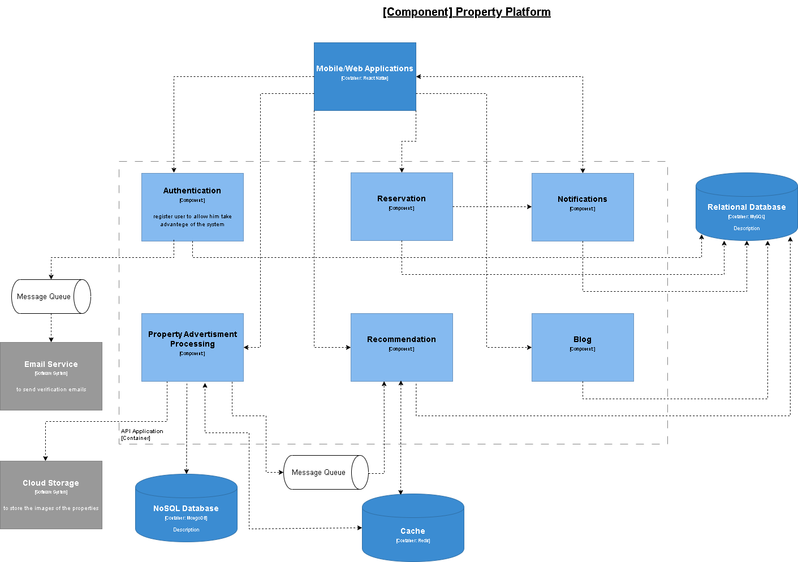

# 🏠 Real Estate Platform

A modern real estate platform designed to streamline property listing, searching, and contract management with a focus on transparency, efficiency, and user trust.

---

## 📌 Overview

This system provides a complete digital solution for real estate interactions by connecting property owners, seekers, and lawyers in one platform.  
It aims to reduce dependency on intermediaries and improve the overall experience through smart features and secure architecture.

---

## 🏗️ System Architecture (High-Level)

---

## 🚀 Features

### 🔐 Security & Authentication
- Reliable Authentication and Authorization using JWT
- Secure role-based access control (User, Admin, Lawyer)

### 🛡️ Data Protection
- Robust exception handling
- Use of DTOs to prevent exposing sensitive data

### ⚡ Performance & Protection
- Rate limiting to prevent API misuse and abuse

### 🔍 Advanced Search
- Multiple search techniques:
  - Keyword-based search
  - Filtering (price, location, size, etc.)
  - Map-based search using coordinates

### 🔔 Real-Time Notifications
- Notification system using WebSockets for real-time updates

### ☁️ Cloud Integration
- Image upload and storage using ImageKit cloud service

### 📄 Contracts Management
- Initial contract creation between seeker and owner
- Integrated lawyer workflow:
  - Review contracts
  - Accept / Reject / Process contracts

### 🧱 Architecture
- Clean layered architecture:
  - Controller Layer
  - Service Layer
  - Repository Layer

---

## 🧰 Tech Stack

### Backend
- Java Spring Boot
- Spring Security (JWT)
- WebSocket

### Database
- MySQL
- MongoDB

### Cloud
- ImageKit (for media storage)

### Other Tools
- RESTful APIs
- Maven

---

## 📡 API Overview

The system exposes RESTful APIs for:
- Authentication & User Management
- Property Management
- Search & Filtering
- Initial Contracts
- Admin Dashboard
- Notifications

> 📌 API documentation available in (./docs/api-docs.md)
